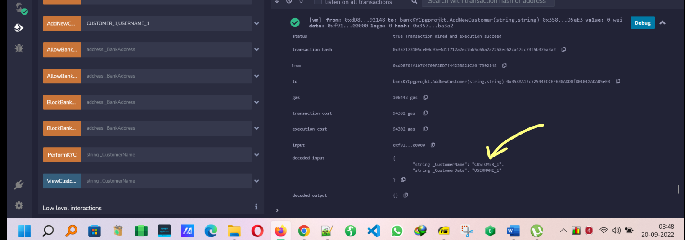
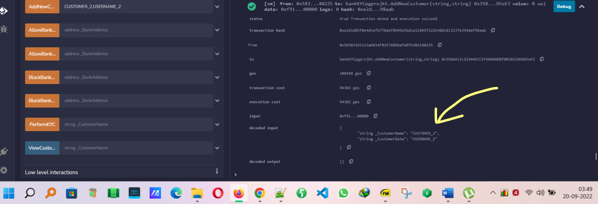

# ethereum Post Graduate KYC project
**SIMPLILEARN Decentralized KYC Verification Process for Banks**

##########----------    Project - DESCRIPTION  ----------############

Central Bank and other government banks face issues in tracking money laundering activities that are used for terrorism and other crimes. It is a threat to national security and is also adversely affecting the economy.

**Background of the problem statement:**

KYC (Know Your Customer) is a service provided by financial institutions such as banks. There are both public and private sector banks managed by a central bank. These banks are banned by the central bank from adding any new customer and do any more customer KYCs as they see suspicious activities that need to be sorted out first. Despite this, the banks add new customers and do the KYC in the background.

An immutable solution is needed where the central bank maintains a list of all the banks and tracks which banks are allowed to add new customers and perform KYC. It can also track which customer KYC is completed or pending along with customer details.

Banks can also add the new customer if allowed and do the KYC of the customers.

**Tools to be used:**

1.  Smart Contract development: Solidity
2.  IDE tool: Remix (Remix makes it quite easy to test the logic of the project as required for the project submission)
3.  Blockchain: Ethereum

**Code developed on REMIX IDE:**

1.  Smart Contract development: Solidity
2.  IDE tool: Remix (Remix makes it quite easy to test the logic of the project as required for the project submission)
3.  Blockchain: Ethereum

**Lets make some assumptions about our address to treated as BANK and ADMIN:**

**WE WILL HAVE:**

1.  **THREE BANKS – BANK_1, BANK_2 and BANK_3 with bank attributes as**
2.  string BankName;
3.  address BankAddress;
4.  bool CanAddCustomer;
5.  bool CanDoKYC;
1.  **THREE CUSTOMERS with name as CUSTOMER_1, CUSTOMER_2 and CUSTOMER_3, having attributes:**
    1.  string CustomerName; - Lets think it as USERNAME, which is unique in the real world.
2.  string CustomerData;
3.  address CustomerBank;
4.  bool KYCstatus;

The first ADDRESS as the admin address :

**0x5B38Da6a701c568545dCfcB03FcB875f56beddC4**

****

Following is the screenshot of the our deployed smart contract from the admin address: - **0x5B38Da6a701c568545dCfcB03FcB875f56beddC4 -- \> also visible in the screenshot belo**

BANK_1 ADDRESS : **0xdD870fA1b7C4700F2BD7f44238821C26f7392148** shown below:

BANK_2 ADDRESS : **0x583031D1113aD414F02576BD6afaBfb302140225** shown below:

BANK_3 ADDRESS : **0x4B0897b0513fdC7C541B6d9D7E929C4e5364D2dB** shown below:

**Testing the Features of the application(with screenshots):**

**1. Adding new bank to Blockchain ledger:**

This function is used by the admin to add a new bank to the KYC Contract. This function can be called by admin only. This function takes the below input parameters:

-   **\_BankName** of string type: The name of the bank
-   \_**BankAddress** of address type: The unique Ethereum address of the bank

    Adding BANK_1, BANK_2 and BANK_3 with the ADMIN address shown below,

    **BANK_1 SUCCESSFULLY ADDED AS SEEN IN LOGS:**

    

    **BANK_2 SUCCESSFULLY ADDED AS SEEN IN LOGS:**

    ****

    **BANK_3 SUCCESSFULLY ADDED AS SEEN IN LOGS:**

    ****

**2. Allowing the bank to add new customers:**

This function can only be used by the admin to allow any bank to add any new customer. This function takes the below input parameter:

-   \_**BankAddress** of address type: The unique Ethereum address of the bank

When adding customer to the bank using unallowed BANK , it gives error as shown below:

BUT LETS NOW ALLOW BANK TO ADD NEW CUSTOMERS:

Now lets allow banks BANK_1 and BANK_2 to add new customers:

BANK_1 allowed below:

BANK_2 allowed below:

**3. Allowing the bank to perform customer KYC:**

This function can only be used by the admin to change the status of KYC Permission of any of the banks at any point of time. This function takes the below input parameter:

-   \_**BankAddress** of address type: Unique Ethereum address of the bank.

    Lets allow banks BANK_1 and BANK_2 to add new customers:

BANK_1 allowed to perform KYC:

BANK_2 allowed to perform KYC:

**4. Blocking the bank to add new customers:**

This function can only be used by the admin to allow any bank to add any new customer. This function takes the below input parameter:

-   \_**BankAddress** of address type: The unique Ethereum address of the bank

Now lets block bank BANK_3 add new customers:

**5. Blocking the bank to perform customer KYC:**

This function can only be used by the admin to change the status of KYC Permission of any of the banks at any point of time. This function takes the below input parameter:

-   \_**BankAddress** of address type: Unique Ethereum address of the bank

Now lets block bank BANK_3 from performing KYC :

**6 Adding New customer to the bank:**

This function will add a customer to the customer list. This function takes the below input parameters:

-   **\_CustomerName** of string type: The name of the customer
-   **\_CustomerData** of string type: Customer supporting data such as address and mobile number

Lets add CUSTOMER_1 , CUSTOMER_2 and CUSTOMER_3 from allowed banks (BANK_1 and BANK_2):

Adding customer FROM the BANK_3(BLOCKED BANK) shows error **as** **expected**, shown below:

**7 Performing the KYC of the customer and update the status:**

This function is used to add the KYC request to the requests list. If a bank is in banned status then the bank won’t be allowed to add requests for any customer. This function takes the below input parameter:

-   **\_CustomerName** of string type: The name of the customer for whom KYC is to be done

Lets perform KYC from the KYC ALLOWED BANKS (BANK_1 and BANK_2):

BANK_1 performing KYC for CUSTOMER_1, SHOWN BELOW:

BANK_2 performing KYC for CUSTOMER_2, SHOWN BELOW:

**8. Viewing customer data:**

This function allows a bank to view details of a customer. This function takes the below input parameter:

-   **\_CustomerName** of string type: The name of the customer

    **LETS VIEW customer date for CUSTOMER_1 and CUSTOMER_2 as shown below:**

    **CUSTOMER_1 shown below with KYC as TRUE:**

    

**CUSTOMER_2 shown below with KYC as TRUE:**

**CUSTOMER_3 shown below has KYC as FALSE(Which will be changed to TRUE by BANK_3 after unblocking the BANK_3 to perform KYC in the next step 8 Demo).**

****

**7. Allowing the bank to add new customers which was banned earlier:**

This function can only be used by the admin to allow any bank to add any new customer. This function takes the below input parameter:

-   \_**BankAddress** of address type: The unique Ethereum address of the bank

Lets allow BANK_3(blocked earlier ), now to allow adding new customers :

**9. Allowing the bank to perform customer KYC which was banned earlier:**

This function can only be used by the admin to change the status of KYC Permission of any of the banks at any point of time. This function takes the below input parameter:

-   \_**BankAddress** of address type: Unique Ethereum address of the bank

Lets allow BANK_3(blocked earlier ), now to perform KYC :

**Now for CUSTOMER_3 , KYC changed from FALSE to TRUE by BANK_3 after having BANK_3 now allowed to perform KYC:**

****

**Conclusion**:

We have been able to achieve an immutable ledger deployed now with KYC identity management solution on the Ethereum distributed ledger. REMIX IDE helped a lot to test the logic.

Thankyou .

**contactmeroshanjha@gmail.com**
